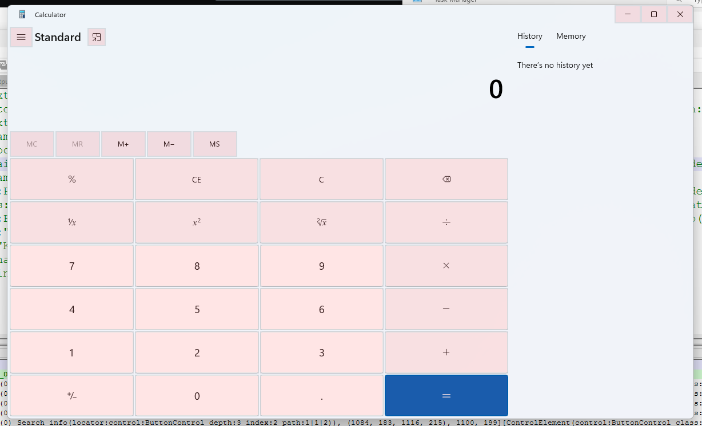

# 01_paint

## target

detect visible button, comboboxes and labels in paint on windows 11 (version 23H2)

## calc example

the windows operating system has a library called uia3. this library can be queried to dump the containment hierarchy of the current state of an application.

~~~
>>> from robocorp import windows
>>> calc = windows.find_window('name:Calculator')
>>> calc.print_tree(show_properties = False, max_depth = 20)

0-0. control:WindowControl class:ApplicationFrameWindow name:Calculator id:"" pid:13472 executable:C:\Windows\System32\ApplicationFrameHost.exe handle:0x40B7C(265084)
    1-1. control:WindowControl class:ApplicationFrameTitleBarWindow name:Calculator id:TitleBar handle:0xC07EE(788462) Search info(depth:1 index:1 path:1)
        2-1. control:MenuBarControl class:"" name:System id:SystemMenuBar handle:0x0(0) Search info(depth:2 index:1 path:1|1)
            3-1. control:MenuItemControl class:"" name:System id:"" handle:0x0(0) Search info(depth:3 index:1 path:1|1|1)
        2-2. control:ButtonControl class:"" name:"Minimise Calculator" id:Minimize handle:0x0(0) Search info(depth:2 index:2 path:1|2)
        2-3. control:ButtonControl class:"" name:"Maximise Calculator" id:Maximize handle:0x0(0) Search info(depth:2 index:3 path:1|3)
        2-4. control:ButtonControl class:"" name:"Close Calculator" id:Close handle:0x0(0) Search info(depth:2 index:4 path:1|4)
    1-2. control:WindowControl class:Windows.UI.Core.CoreWindow name:Calculator id:"" handle:0x409F4(264692) Search info(depth:1 index:2 path:2)
        2-1. control:ImageControl class:Image name:"" id:AppIcon handle:0x0(0) Search info(depth:2 index:1 path:2|1)
        2-2. control:TextControl class:TextBlock name:Calculator id:AppName handle:0x0(0) Search info(depth:2 index:2 path:2|2)
        2-3. control:CustomControl class:"" name:"" id:NavView handle:0x0(0) Search info(depth:2 index:3 path:2|3)
            3-1. control:ButtonControl class:Button name:"Open Navigation" id:TogglePaneButton handle:0x0(0) Search info(depth:3 index:1 path:2|3|1)
                4-1. control:TextControl class:TextBlock name:"" id:PaneTitleTextBlock handle:0x0(0) Search info(depth:4 index:1 path:2|3|1|1)
            3-2. control:GroupControl class:LandmarkTarget name:"" id:"" handle:0x0(0) Search info(depth:3 index:2 path:2|3|2)
                4-1. control:TextControl class:"" name:"Expression is " id:CalculatorExpression handle:0x0(0) Search info(depth:4 index:1 path:2|3|2|1)
                4-2. control:TextControl class:"" name:"Display is 0" id:CalculatorResults handle:0x0(0) Search info(depth:4 index:2 path:2|3|2|2)
...
                4-7. control:GroupControl class:NamedContainerAutomationPeer name:"Number pad" id:NumberPad handle:0x0(0) Search info(depth:4 index:7 path:2|3|2|7)
                    5-1. control:ButtonControl class:Button name:Zero id:num0Button handle:0x0(0) Search info(depth:5 index:1 path:2|3|2|7|1)
                        6-1. control:TextControl class:TextBlock name:0 id:"" handle:0x0(0) Search info(depth:6 index:1 path:2|3|2|7|1|1)
...
                    5-10. control:ButtonControl class:Button name:Nine id:num9Button handle:0x0(0) Search info(depth:5 index:10 path:2|3|2|7|10)
                        6-1. control:TextControl class:TextBlock name:9 id:"" handle:0x0(0) Search info(depth:6 index:1 path:2|3|2|7|10|1)
                    5-11. control:ButtonControl class:Button name:"Decimal separator" id:decimalSeparatorButton handle:0x0(0) Search info(depth:5 index:11 path:2|3|2|7|11)
                        6-1. control:TextControl class:TextBlock name:. id:"" handle:0x0(0) Search info(depth:6 index:1 path:2|3|2|7|11|1)
                4-8. control:ButtonControl class:Button name:"Positive negative" id:negateButton handle:0x0(0) Search info(depth:4 index:8 path:2|3|2|8)
                    5-1. control:TextControl class:TextBlock name: id:"" handle:0x0(0) Search info(depth:5 index:1 path:2|3|2|8|1)
                4-9. control:GroupControl class:NamedContainerAutomationPeer name:"History and Memory lists" id:DockPanel handle:0x0(0) Search info(depth:4 index:9 path:2|3|2|9)
                    5-1. control:TabControl class:Pivot name:"" id:DockPivot handle:0x0(0) Search info(depth:5 index:1 path:2|3|2|9|1)
                        6-1. control:TabItemControl class:PivotItem name:"There’s no history yet History" id:HistoryLabel handle:0x0(0) Search info(depth:6 index:1 path:2|3|2|9|1|1)
                            7-1. control:TextControl class:TextBlock name:"There’s no history yet" id:HistoryEmpty handle:0x0(0) Search info(depth:7 index:1 path:2|3|2|9|1|1|1)
                        6-2. control:TabItemControl class:PivotItem name:"There’s nothing saved in your memory Memory" id:MemoryLabel handle:0x0(0) Search info(depth:6 index:2 path:2|3|2|9|1|2)
            3-3. control:TextControl class:TextBlock name:"Standard Calculator mode" id:Header handle:0x0(0) Search info(depth:3 index:3 path:2|3|3)
            3-4. control:ButtonControl class:Button name:"Keep on top" id:NormalAlwaysOnTopButton handle:0x0(0) Search info(depth:3 index:4 path:2|3|4)
                4-1. control:TextControl class:TextBlock name: id:"" handle:0x0(0) Search info(depth:4 index:1 path:2|3|4|1)
    1-3. control:PaneControl class:ApplicationFrameInputSinkWindow name:"" id:"" handle:0x70A24(461348) Search info(depth:1 index:3 path:3)
~~~

~~~
>>> calc.inspect()
~~~
and "h: control:ButtonControl" yields the following visual result:

As of now, relative image links are working for me, in both a repository and a wiki. I'm using syntax like this:

